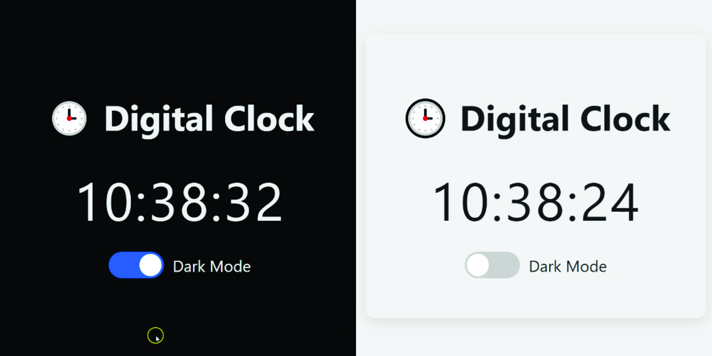

# 🕒 Real‑Time Digital Clock with Dark/Light Mode

A simple, responsive digital clock built with pure HTML, CSS custom properties, and vanilla JavaScript—complete with a dark/light mode toggle. Perfect as a “Code of the Day” exercise or a lightweight widget to drop into any project.

---

## Table of Contents

1. [Demo](#demo)  
2. [Features](#features)  
3. [Technologies](#technologies)  
4. [Installation](#installation)  
5. [Usage](#usage)  
6. [File Structure](#file-structure)  
7. [Customization](#customization)  
8. [Contributing](#contributing)  
9. [License](#license)  

---

## Demo



---

## Features

- **Real‑time clock** updating every second  
- **Dark/light theme** toggle with smooth CSS transitions  
- Clean, semantic HTML structure  
- Scoped CSS custom properties for easy theming  
- Vanilla JavaScript (no frameworks or libraries)  

---

## Technologies

- **HTML5**  
- **CSS3** (Custom Properties, Transitions)  
- **JavaScript** (ES6+)  

---

## Installation

1. **Clone the repo**  
   ```bash
   git clone https://github.com/codewithoyem/digital_clock-100daysofcode.git
   cd digital-clock-dark-mode
